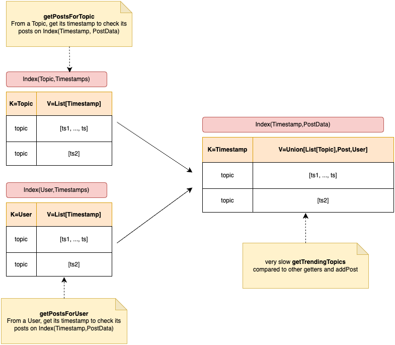
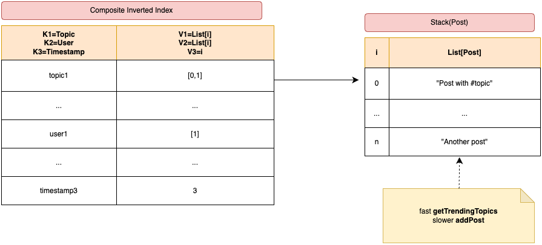

# README

Main: 

Latest commit pushed: 

:warning: _PLEASE DO READ ME ENTIRELY, IT IS VERY IMPORTANT._ :warning:

author: @Rxinui

## Introduction

This challenge is solved using Python3.12 with built-in modules only.
The structure of this repository lists the following

```
- yodelr.py:    Yodelr model file
- v1.py:        Implementation of Yodelr
- tests/:       Tests files and datasets samples
- docs/:        Docs and figures
- .github/**/:  Workflows for CI/CD
```

## Analysis, Strategy and Methodology

### Analysis

The Yodelr system induces 2 big challenges:

1. How to structure the data to implement getters in reasonable time
2. How to minimise the time-space complexity of `getTrendingTopic`

On that basis, it seems interesting to start with a `v1` to:

- Speed up the implementation of the Yodelr API in order to identify potential issues and edge cases
- Populate testings with the first prototype. Adapt from `v1` to `v2` if necessary

### Strategy - Roadmap

Create rapidly `v1`:

1. Design a data structure to implement Yodler API
2. Proceed with the joint implementation of tests and features
3. Confirm the test coverage of the Yodler API `v1`

By 26.02.2025, create `v2` which uses a non-linear data structure:

1. Design an optimal (non-)linear data structure to implement Yodler API and outperform `v1`
2. Proceed with to the implementation of helpers function that manages the data structure
3. Implement the Yodler API functions
4. Confirm the test coverage of the Yodler API `v2`

By the deadline, if my schedule allows it, create a `v3` which uses advanced algorithm to perform better than `v2`

1. Tweak methods, functions and if requires, the data structure, to reduce the time complexity.
2. Confirm the test coverage of the Yodler API `v3`

### Methodology

**NO AGILE METHODS. THAT IS SUCH A BAD IDEA (here)**

- For such small use case, the most important is to [**remain organised** and set a clear direction](https://github.com/Rxinui/fun-challenge/issues?q=is%3Aissue%20state%3Aclosed) (and stick to it).
- **Priority is given to tests**, to finish the Mission (`v1`). What is the purpose of having the most optimal solution (`v2`, maybe `v3`) if the mission is not achieved? :nerd_face:
- GitHub Release from tags `v1`, `v2` and potentially `v3`, through CI/CD
- Trunk-Based Development (TBD) as git flow is best-suited here for a single-engineer fan of CI.

## Setup

To facilitate the setup and ensure compliance accross machines, a `Dockerfile` is present as evidence and utility to build-and-run the challenge in a clean environment.
In addition, a `Makefile` is provided to initiate manual and automated testing

### Option 1 - Run tests and perftests on the CI (recommended)

1. Go to [CI workflow](https://github.com/Rxinui/fun-challenge/actions/workflows/ci.yaml) > `Run workflow` > Click on run
2. If workflow is a success, [a new workflow for performance tests will be triggered](https://github.com/Rxinui/fun-challenge/actions/workflows/perftest.yaml)

### Option 2 - Build and run unit tests

**Pre-requisites**: `podman >=5.4.0` or `docker >=27.5.1`

```shell
make unittest-in-container
make perftest-in-container # if you want to run perf tests
```

### Option 3 - Build and run main.py

Add your own manual instructions within `main.py` and execute the script

```shell
make run-main # Run main.py within a container
```

## Results - benchmark

### `v1` data structure

[Source code v1](https://github.com/Rxinui/fun-challenge/releases/tag/v1)



`v1` uses 3 dictionnaries. The idea behind is to associate an index to a getter's parameter:

- `getPostsForUser` -> one `Index(User,Timestamps)`
- `getPostsForTopic` -> one `Index(Topic,Timestamps)`

and one index to store the data by timestamp `Index(Timestamp,PostData)`. This enable:

- From a `user`, fetch its list of timestamp and get its posts from it
- From a `topic`, fetch its list of timestamp and get its posts from it

However, this _stupid and simple_ idea complexify the `getTrendingTopics` in exchange of quick access using other getters and `addPost`.

**This is not elegant, but it helps to build tests quickly and have a baseline for benchmark.**

### `v2` data structure

[Source code v2](https://github.com/Rxinui/fun-challenge/releases/tag/v2)



`v2` uses the same concept as time-serie database (ie. Prometheus), since it is driven by timestamp, having a list of data and an invertedindex allows to balance performance with getters and setters.

- Pros: Quick access from the inverted index -> list of data
- Cons: Processing of extract topics at every call of `getTrendingTopics`. Since, the limitation of a post is 140 chars, it is not that much of an inconvenience.

### Benchmark `v1` and `v2`

[See v1 run here](https://github.com/Rxinui/fun-challenge/actions/runs/13494439099/job/37698491382)

| v1                | w=100     | w=1000     | w=10000    | w=1000000   |
| ----------------- | --------- | ---------- | ---------- | ----------- |
| deleteUser        | 0.011106s | 0.011120s  | 0.011937s  | 0.017365s   |
| addPost           | 0.001842s | 0.047871s  | 2.804578s  | 270.657196s |
| getPostsForUser   | 0.001247s | 0.008426s  | 0.202649s  | :x:         |
| getPostsForTopic  | 0.002455s | 0.012315s  | 0.025201s  | :x:         |
| getTrendingTopics | 0.202969s | 16.853485s | 81.631433s | :x:         |

[See v2 run here](https://github.com/Rxinui/fun-challenge/actions/runs/13494439099/job/37698491382)

| v2                | w=100     | w=1000    | w=10000    | w=1000000   |
| ----------------- | --------- | --------- | ---------- | ----------- |
| deleteUser        | 0.011956s | 0.011335s | 0.013506s  | 0.016078s   |
| addPost           | 0.001181s | 0.024612s | 0.915521s  | 77.096798s  |
| getPostsForUser   | 0.000861s | 0.002057s | 0.011247s  | 0.491179s   |
| getPostsForTopic  | 0.002468s | 0.011895s | 0.020240s  | 0.049816s   |
| getTrendingTopics | 0.090285s | 5.176679s | 33.581007s | 614.128843s |

**Summary `v1` vs `v2`**

|                   | v1                 | v2                 |
| ----------------- | ------------------ | ------------------ |
| deleteUser        | :white_check_mark: | :white_check_mark: |
| addPost           | :turtle:           | :rabbit2:          |
| getPostsForUser   | :turtle:           | :rabbit2:          |
| getPostsForTopic  | :white_check_mark: | :white_check_mark: |
| getTrendingTopics | :snail:            | :dromedary_camel:  |

`v2` has a better implementation and a better data structure choice than `v1`. As shown a XLarge size (w=100000), only `v2` is capable of processing methods. Some optimisation can be done, in term of algorithms to enhance `v2` performances.

`v2` can be turned into a `v3` by:

- Implementing a better search of timestamp between `from_timestamp` and `to_timestamp` using `binary search`
- Shift values of `posts` to the left to erase `None` which marks a deleted post

**NOTE: to run your benchmark, [click on Run workflow](https://github.com/Rxinui/fun-challenge/actions/workflows/benchmark.yaml)**
